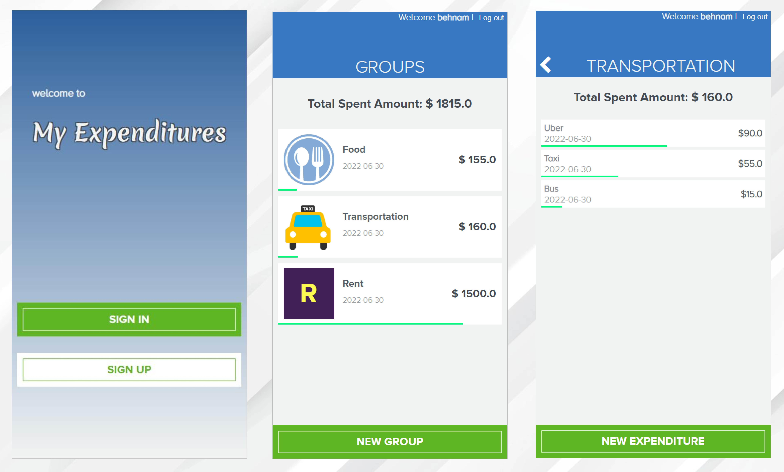
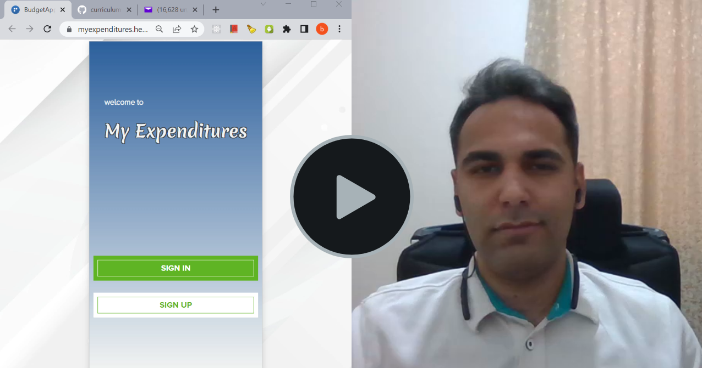

 

# Budget App

A simple budget app created using Ruby on Rail.

# How it looks like

# Live demo 

Please check out the [live demo deployed on heroku](https://myexpenditures.herokuapp.com/). 

# Presentational Video 

<!--  -->

# Requirements for this project

You can find requirements for this project [here].(https://github.com/microverseinc/curriculum-rails/blob/main/capstone/rails_capstone.md)

## Installation & Usage

To get a local copy follow these simple example steps. 
- Make sure you have `Postgres` and `Ruby` installed. 
- Open the terminal window and clone the repository using this command: `git@github.com:Behnam1369/budget-app.git` 
- Open the repo by typing : `cd rails-blog`
- Install the project's dependencies by running this command: `bundle install` 
- Make sure you have database user called `postgres`.
- Make sure you have a `db.rb` file under the `config` folder and it should be containing `ENV['BUDGET_APP_DATABASE_PASSWORD'] = 'your_password'`.
- run `rails db:create` to create the database.
- run `rails db:migrate` to create the the dchema. 
- run `rails s` to start the application on local server. 
- To test the project, run `rspec` in your terminal 

## Technologies

- Ruby
- Rails 
- Postgres 
- Rspec
- Capybara
- javascript
- Scss

## Author

👤 **Behnam Aghaali**

- GitHub: [https://github.com/Behnam1369](https://github.com/Behnam1369)
- LinkedIn: [https://www.linkedin.com/in/behnam-aghaali](https://www.linkedin.com/in/behnam-aghaali)
- Twitter: [https://twitter.com/behnamagh1369](https://twitter.com/behnamagh1369)

Original design idea by [Gregoire Vella on Behance](https://www.behance.net/gregoirevella).

## 🤝 Contributing

Contributions, issues, and feature requests are welcome!

Feel free to check the [issues page](https://github.com/Behnam1369/Catalog_of_my_things/issues).

## Show your support

Give a ⭐️ if you like this project!

## Acknowledgments

- Hat tip to anyone whose code was used
- Inspiration
- etc

## 📝 License

This project is [MIT](./LICENSE) licensed.